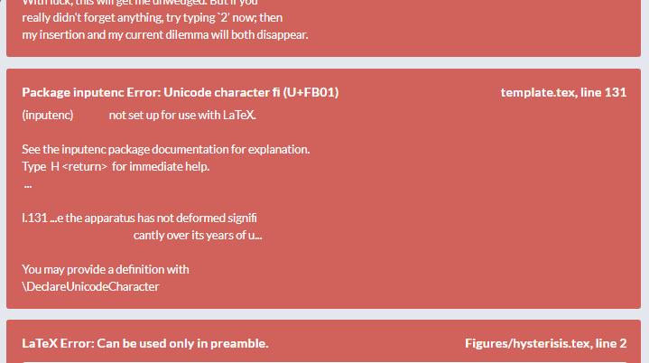

## LaTeX + Me

As a basis for the inspiration of this concept, some background about LaTeX, and my not-so-cordial relationship with the document creation software.

### ***LaTeX***

**LaTeX** - (/ˈlɑːtɛx/ LAH-tekh or /ˈleɪtɛx/ LAY-tekh, often stylized as LATEX) is a software system for document preparation. When writing, the writer uses plain text as opposed to the formatted text found in "What You See Is What You Get" word processors like Microsoft Word, LibreOffice Writer and Apple Pages. [https://en.wikipedia.org/wiki/LaTeX]

LaTeX was designed with academic papers and documents as its focus, with simple means for publishes to compile many papers into a single document with a consistent design.

In other words, LaTeX converts **this**:

To **This**:

Which is pretty cool, but unfortunately it's often accompanied by **this**:

In short, LaTeX lets you **script documents**, with consistent results and a myriad of incredibly powerful tools and extension packages. If you're an experienced TeX-er, or are willing to spend a fair amount of time hammering it into submission, the **results look very good!**

### ***Me***

*I am an undergraduate engineering student,* and LaTeX offers a compelling option for writing my lab-reports, lecture and topic notes and other ~professional~ style documents such as my CV. The images above are from the source of a first year project report I wrote in 2019.

LaTeX is pretty cool and my goto for these documents, but I hate LaTeX with a burning passion.

- Every file I have created with **LaTeX has taken far far longer** than the same document would likely have taken in Word, or even LibreOffice for that matter.

- If online **services such as [OverLeaf](https://overleaf.com)** didn't exist LaTeX would be a no-go, as choosing and setting up a single LaTeX distribution (e.g. TeX Live or MiKeTeX) is overly **convoluted and annoying**.

- Super simple documents still result in **abstract errors**, but **will compile** into a .pdf file regardless of the fact.

- LaTeX is far more functional and powerful than is necessary for the files I work on, and hence includes **much greater complexity than I actually require.**

- LaTeX is great for precise drawings and diagrams, and terrible for quick sketches.

The Resolution:
> I want a tool that is designed to the requirements of an undergraduate student, rather than an academic journal. A tool focussed on simplistic reports, lecture and topic notes and the likes.

****

## NoTeX-Concept - a LaTeX style Doc Gen with the needs of undergraduate STEM students at its core

The idea is to create a Doc Gen tool of a similar style and functionality or LaTeX, but designed to meet the needs of undergraduate stem students [myself].
A non-exhaustive spec list of what I want to achieve is as follow:

- A Simplistic, Programmatic and strongly checked Document Generator that converts from a script to .pdf's or similar.

- It should have excellent support for quick creation of diagrams and sketches.

- Frequent page options should be simple and accessible, and defaulted.
  
- It should be cross-platform, and require no convoluted downloads or setup steps.

- It should have excellent linting and Intelligent auto-fill coding.

- It should be easy to hack, modify and contribute to.

- It may support inline scripts to perform programmatic operations within a document.

- It should offer only the minimum necessary complexity internally, and allow for extension wherever needed.

- It may consist of multiple separate tools that combine, (UI, Daemon etc.)

Currently I am in the process of developing the spec, and designing a project architecture.

**If you have a feature request to add to the spec, that you believe would make a tool such as this more valuable to you (e.g. include a built in plotting tool for basic sketching) please post a *Feature Request* as a [GitHub Issue](https://github.com/LukJA/NoTeX-Concept/issues).**

